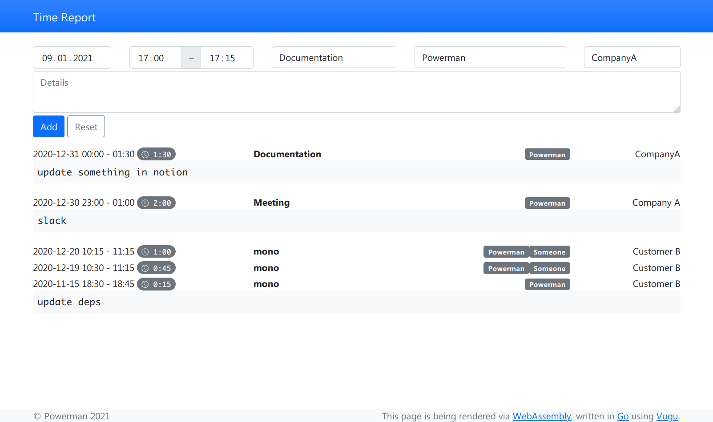

# Time Report

[](https://pkg.go.dev/github.com/powerman/tr)
[](https://goreportcard.com/report/github.com/powerman/tr)
[](https://github.com/golang-standards/project-layout)
[](https://github.com/powerman/tr/releases/latest)

Experimental web app using Go [Vugu](https://www.vugu.org/) frontend.



## Development

### Requirements

```sh
GO111MODULE=off go get -u github.com/myitcv/gobin
curl -sSfL https://github.com/koalaman/shellcheck/releases/download/v0.7.1/shellcheck-v0.7.1.$(uname).x86_64.tar.xz | sudo tar xJf - -C /usr/local/bin --strip-components=1 shellcheck-v0.7.1/shellcheck
```

### Usage

```sh
go run ./cmd/server -dev
```

## Roadmap

- [x] Learn how to develop frontend in Go using Vugu.
- [x] Improve development experience with Vugu:
  - [x] Use `gobin` and `tools.go` to install all tools without `vgrun`.
  - [x] Implement simple (dev)server which doesn't require `vgrun` to
    provide live reload functionality while development and at same time
    is production-ready, so there is no need in using different servers
    while development and in production (in case production won't be
    deployed as static files and will have a server implemented in Go).
  - [x] Replace trivial live reloading implementation in `vgrun` with more
    advanced 3rd-party [livereload.js](https://github.com/livereload/livereload-js) project.
    - [ ] Move it from `pkg/{livereload,broadcast}` to own repo.
  - [x] Avoid embedding html/js files in Go modules: either use real files
    in `web/static/` or load them from some CDN.
  - [x] Add support to recursive watch for changed files on dev for
    triggering rebuilding wasm and live reloading in browser.
    - [ ] Probably replace with own implementation, because it looks like
      used module doesn't support Windows and sometimes fail to detect
      changes (need more testing to find out exact cases when it happens).
  - [x] Deliver build wasm error into browser by using alternative trivial
        wasm app.
    - [ ] Move this app to own repo, to avoid having it in web/error in
          each Vugu project.
    - [ ] Try to use consistent default styling for error messages in this
          app, default `index.html` and default `run_app.js`?
  - [ ] Make `web/static/js/run_app.js` more general by accepting arg with
        url to wasm file? Maybe even deploy it to CDN?
  - [ ] Find a way to load `wasm_exec.js` from CDN, matching current app's
        `runtime.Version`?
  - [x] Cleanup/improve a bit default `web/static/index.html`.
  - [x] Force automatic updates of `main_wasm.go`.
    - [ ] Add "DO NOT EDIT" header? Probably makes sense to add this
          feature to `vugugen` (disabled by default using flag).
  - [ ] Provide a way to build without bash to make it work on Windows?
  - [ ] After everything above and web/app will be implemented and tested
        try to move general code and tools into their own repos.
- [ ] web/app:
  - [ ] Implement all required features:
    - [x] List records.
    - [x] Add new record.
    - [ ] Edit record.
    - [ ] Delete record.
    - [ ] Summary report for chosen time period.
    - [ ] Interaction with backend API.
  - [ ] Add (wire?) support for global events between components only?
  - [ ] Find out how to test frontend and write automated tests.
- [ ] Implement backend.
- [ ] Configure GitHub Actions.
